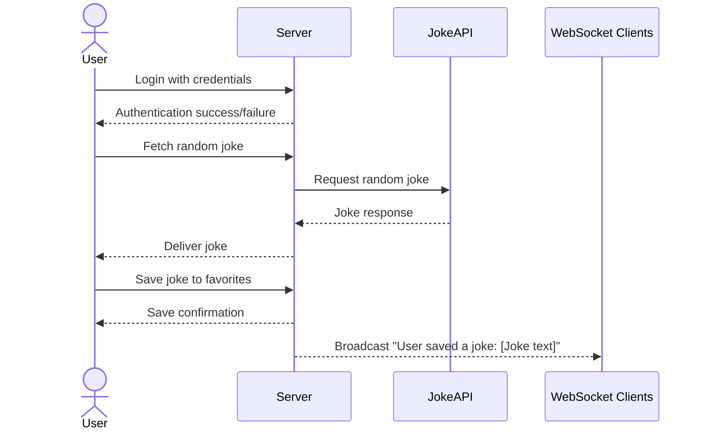

# Gigglr

Gigglr is a random joke generator which is a fun and interactive web application designed to provide users with a continuous stream of random jokes. Users can log in to save their favorite jokes for future laughs and view them in a personalized list. The app fetches jokes from a third-party API, ensuring a wide variety of humor. Additionally, it updates saved jokes in real-time, allowing users to share their favorites with friends instantly. With a clean and responsive design, the application is easy to use and guarantees a lighthearted experience for all.

## 🚀 Specification Deliverable

For this deliverable I did the following. I checked the box `[x]` and added a description for things I completed.

- [x] Proper use of Markdown
- [x] A concise and compelling elevator pitch
- [x] Description of key features
- [x] Description of how you will use each technology
- [x] One or more rough sketches of your application. Images must be embedded in this file using Markdown image references.

### Elevator pitch

Need a good laugh? The Random Joke Generator delivers endless fun by fetching random jokes tailored to your mood. Save your favorites, revisit them anytime, and share the joy with friends in real time. With a clean and intuitive design, this app ensures you never miss a punchline!

### Design

The design of the Random Joke Generator revolves around simplicity and user interactivity, as illustrated in the sequence diagram. The application begins with the user fetching a random joke, which the backend retrieves from an external API and delivers to the user interface. A "Save to Favorites" button allows users to save a joke they enjoy, sending a request to the backend to store the joke in a database tied to their account. Once saved, the server confirms the action and broadcasts the updated favorite list to all connected clients in real time using WebSocket technology. This ensures that the user's saved jokes are accessible across devices and visible to others instantly. The design incorporates separate pages for login, joke display, and favorites, leveraging React components and routing to create a dynamic and responsive user experience.

### Key features

- Secure user login.
- Display random jokes fetched from an external API.
- Save favorite jokes for later viewing.
- View and manage a list of saved jokes.
- Realtime updates when a joke is saved.
- Responsive and engaging design.
- 
## Technologies Used

### HTML
- Basic structure for the app:
  - **Login Page**: Allow users to log in or sign up.
  - **Joke Display Page**: Show a random joke fetched from the server.
  - **Favorites Page**: Display and manage saved jokes.

### CSS
- **Styling Features**:
  - Clean and responsive UI for seamless user experience on any device.
  - Animated joke cards for visual appeal.
  - A color scheme that enhances readability and maintains a playful vibe.

### React
- **Componentized Structure**:
  - **Login Form**: Handles user authentication.
  - **Joke Display**: Fetches and shows random jokes dynamically.
  - **Favorites List**: Displays saved jokes for logged-in users.
- **Routing**: Utilizes React Router for smooth navigation between pages.

### Service
- **Backend Endpoints**:
  - Fetching random jokes from a third-party API.
  - User login and authentication.
  - Saving and retrieving favorite jokes for each user.

### DB/Login
- **MongoDB**:
  - Stores user credentials securely with hashing.
  - Keeps a record of user-specific saved jokes.
- **Access Restrictions**:
  - Only logged-in users can save and retrieve jokes.

### WebSocket
- **Real-Time Updates**:
  - Broadcasts notifications to all users when a new joke is added to the shared favorites list.
  - Ensures real-time interactivity across connected clients.

## 🚀 AWS deliverable

For this deliverable I did the following. I checked the box `[x]` and added a description for things I completed.

- [x] **Server deployed and accessible with custom domain name** - [My server link](https://trevorscs260.click).

## 🚀 HTML deliverable

For this deliverable I did the following. I checked the box `[x]` and added a description for things I completed.

- [ ] **HTML pages** - I did not complete this part of the deliverable.
- [ ] **Proper HTML element usage** - I did not complete this part of the deliverable.
- [ ] **Links** - I did not complete this part of the deliverable.
- [ ] **Text** - I did not complete this part of the deliverable.
- [ ] **3rd party API placeholder** - I did not complete this part of the deliverable.
- [ ] **Images** - I did not complete this part of the deliverable.
- [ ] **Login placeholder** - I did not complete this part of the deliverable.
- [ ] **DB data placeholder** - I did not complete this part of the deliverable.
- [ ] **WebSocket placeholder** - I did not complete this part of the deliverable.

## 🚀 CSS deliverable

For this deliverable I did the following. I checked the box `[x]` and added a description for things I completed.

- [ ] **Header, footer, and main content body** - I did not complete this part of the deliverable.
- [ ] **Navigation elements** - I did not complete this part of the deliverable.
- [ ] **Responsive to window resizing** - I did not complete this part of the deliverable.
- [ ] **Application elements** - I did not complete this part of the deliverable.
- [ ] **Application text content** - I did not complete this part of the deliverable.
- [ ] **Application images** - I did not complete this part of the deliverable.

## 🚀 React part 1: Routing deliverable

For this deliverable I did the following. I checked the box `[x]` and added a description for things I completed.

- [ ] **Bundled using Vite** - I did not complete this part of the deliverable.
- [ ] **Components** - I did not complete this part of the deliverable.
- [ ] **Router** - Routing between login and voting components.

## 🚀 React part 2: Reactivity

For this deliverable I did the following. I checked the box `[x]` and added a description for things I completed.

- [ ] **All functionality implemented or mocked out** - I did not complete this part of the deliverable.
- [ ] **Hooks** - I did not complete this part of the deliverable.

## 🚀 Service deliverable

For this deliverable I did the following. I checked the box `[x]` and added a description for things I completed.

- [ ] **Node.js/Express HTTP service** - I did not complete this part of the deliverable.
- [ ] **Static middleware for frontend** - I did not complete this part of the deliverable.
- [ ] **Calls to third party endpoints** - I did not complete this part of the deliverable.
- [ ] **Backend service endpoints** - I did not complete this part of the deliverable.
- [ ] **Frontend calls service endpoints** - I did not complete this part of the deliverable.

## 🚀 DB/Login deliverable

For this deliverable I did the following. I checked the box `[x]` and added a description for things I completed.

- [ ] **User registration** - I did not complete this part of the deliverable.
- [ ] **User login and logout** - I did not complete this part of the deliverable.
- [ ] **Stores data in MongoDB** - I did not complete this part of the deliverable.
- [ ] **Stores credentials in MongoDB** - I did not complete this part of the deliverable.
- [ ] **Restricts functionality based on authentication** - I did not complete this part of the deliverable.

## 🚀 WebSocket deliverable

For this deliverable I did the following. I checked the box `[x]` and added a description for things I completed.

- [ ] **Backend listens for WebSocket connection** - I did not complete this part of the deliverable.
- [ ] **Frontend makes WebSocket connection** - I did not complete this part of the deliverable.
- [ ] **Data sent over WebSocket connection** - I did not complete this part of the deliverable.
- [ ] **WebSocket data displayed** - I did not complete this part of the deliverable.
- [ ] **Application is fully functional** - I did not complete this part of the deliverable.
