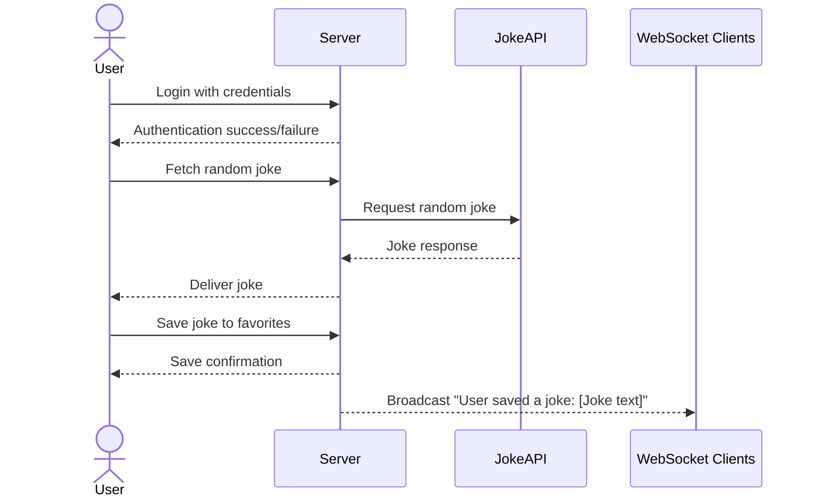

# Gigglr

Gigglr is a random joke generator which is a fun and interactive web application designed to provide users with a continuous stream of random jokes. Users can log in to save their favorite jokes for future laughs and view them in a personalized list. The app fetches jokes from a third-party API, ensuring a wide variety of humor. Additionally, it updates saved jokes in real-time, allowing users to share their favorites with friends instantly. With a clean and responsive design, the application is easy to use and guarantees a lighthearted experience for all.

## 🚀 Specification Deliverable


For this deliverable I did the following. I checked the box `[x]` and added a description for things I completed.

- [x] Proper use of Markdown
- [x] A concise and compelling elevator pitch
- [x] Description of key features
- [x] Description of how you will use each technology
- [x] One or more rough sketches of your application. Images must be embedded in this file using Markdown image references.

### Elevator pitch

Need a good laugh? The Random Joke Generator delivers endless fun by fetching random jokes tailored to your mood. Save your favorites, revisit them anytime, and share the joy with friends in real time. With a clean and intuitive design, this app ensures you never miss a punchline!

### Design


The design of the Random Joke Generator revolves around simplicity and user interactivity, as illustrated in the sequence diagram. The application begins with the user fetching a random joke, which the backend retrieves from an external API and delivers to the user interface. A "Save to Favorites" button allows users to save a joke they enjoy, sending a request to the backend to store the joke in a database tied to their account. Once saved, the server confirms the action and broadcasts the updated favorite list to all connected clients in real time using WebSocket technology. This ensures that the user's saved jokes are accessible across devices and visible to others instantly. The design incorporates separate pages for login, joke display, and favorites, leveraging React components and routing to create a dynamic and responsive user experience.



### Key features

- Secure user login.
- Display random jokes fetched from an external API.
- Save favorite jokes for later viewing.
- View and manage a list of saved jokes.
- Realtime updates when a joke is saved.
- Responsive and engaging design.
- 
## Technologies Used

### HTML
- Basic structure for the app:
  - **Login Page**: Allow users to log in or sign up.
  - **Joke Display Page**: Show a random joke fetched from the server.
  - **Favorites Page**: Display and manage saved jokes.

### CSS
- **Styling Features**:
  - Clean and responsive UI for seamless user experience on any device.
  - Animated joke cards for visual appeal.
  - A color scheme that enhances readability and maintains a playful vibe.

### React
- **Componentized Structure**:
  - **Login Form**: Handles user authentication.
  - **Joke Display**: Fetches and shows random jokes dynamically.
  - **Favorites List**: Displays saved jokes for logged-in users.
- **Routing**: Utilizes React Router for smooth navigation between pages.

### Service
- **Backend Endpoints**:
  - Fetching random jokes from a third-party API.
  - User login and authentication.
  - Saving and retrieving favorite jokes for each user.

### DB/Login
- **MongoDB**:
  - Stores user credentials securely with hashing.
  - Keeps a record of user-specific saved jokes.
- **Access Restrictions**:
  - Only logged-in users can save and retrieve jokes.

### WebSocket
- **Real-Time Updates**:
  - Broadcasts notifications to all users when a new joke is added to the shared favorites list.
  - Ensures real-time interactivity across connected clients.


## 🚀 AWS deliverable

For this deliverable I did the following. I checked the box `[x]` and added a description for things I completed.

- [x] **Server deployed and accessible with custom domain name** - [My server link](https://trevorscs260.click).

## 🚀 HTML deliverable

For this deliverable I did the following. I checked the box `[x]` and added a description for things I completed.

- [x] **HTML pages** - index.html, generateJokes.html, savedJokes.html, and about.html
- [x] **Proper HTML element usage** - ✔ Proper Semantic Elements (header, nav, main, footer, etc)
✔ Correct Use of Forms & Inputs (email, password, submit buttons)
✔ JavaScript Enhancements (dynamically updating username & jokes)
✔ Navigation & Accessibility (structured menu & screen reader-friendly)
✔ Data Persistence via URL Parameters (preserves login details)
- [x] **Links** - Included links for each html page and links to generate jokes page from the login.  Also included link to github on each page.
- [x] **Text** - text in the about page and text for the jokes generated/saved
- [x] **3rd party API placeholder** - Inluded a generate button that will pull jokes from a 3rd party.
- [x] **Images** - created a favicon.ico for the icon in the top and also added an image in the about section.
- [x] **Login placeholder** - Username and password that then takes you to the generate jokes page.
- [x] **DB data placeholder** - Added a html page that displays all of the users saved jokes.
- [x] **WebSocket placeholder** - added a placeholder that shows all of the recently saved jokes by users. 

## 🚀 CSS deliverable

For this deliverable I did the following. I checked the box `[x]` and added a description for things I completed.

- [x] **Header, footer, and main content body** - I made the header and footer full-width with a dark background, fixed the header at the top with a shadow, and centered the main content vertically with padding to avoid overlap with the fixed header.
- [x] **Navigation elements** - I styled the navigation elements by using a `<menu>` inside `<nav>`, making it a flex container centered with evenly spaced items, and giving the links a bold, yellow color that changes to orange with an underline on hover. However, note that `<menu>` is not the typical element used for navigation; `<ul>` is more common.

- [x] **Responsive to window resizing** - The header and footer span the full width of the viewport, while the main content remains centered using display: flex and min-height: 80vh to adjust with varying screen heights. The form and input fields use max-width: 400px and width: 100%, making them responsive while maintaining a structured layout. Additionally, using gap and padding for spacing ensures elements remain visually balanced across different screen sizes.
- [x] **Application elements** - I designed interactive components like a joke generator with dynamically updating text, a save joke button that appears conditionally, and a personalized welcome message extracted from the URL parameters. Additionally, the navigation menu, notifications, and structured layout ensure a user-friendly experience, while smooth animations and transitions enhance interactivity and responsiveness.
- [x] **Application text content** - I used application text content dynamically by displaying a personalized welcome message based on the URL parameters and updating the joke text upon button clicks. Additionally, you included pre-saved jokes from other users as part of the UI, reinforcing user interaction and engagement with meaningful and context-aware content.  I also included hover and button animations to my generate joke button because I felt my webpage may be too simple compared to others. 
- [x] **Application images** - I incorporated application images by including a favicon (favicon.ico) in the `<head>` section, which helps with branding and recognition in browser tabs. I also included an image in the about section with a feded gray border, the overall design relies on structured text and styled elements to create a visually engaging experience without requiring additional graphics.

## 🚀 React part 1: Routing deliverable

For this deliverable I did the following. I checked the box `[x]` and added a description for things I completed.

- [x] **Bundled using Vite** -
* **Project Setup:** Initialized the project as an npm package and installed Vite.
* **Configuration:** Configured `package.json` with `dev`, `build`, and `preview` scripts.
* **Building:** Ran the `build` script, which:
    * Transpiled JSX to JavaScript.
    * Bundled code into optimized chunks.
    * Generated static assets.
    * Created a production build in the `dist` directory.
* **Deployment:** Used a deployment script to:
    * Build the project.
    * Clean the server.
    * Copy the contents of the `dist` directory.  This optimized the deliverable for production.
- [x] **Components** -
created functional React components, often within separate files, and then importing and using them within other components or the main application.  JSX syntax is used within these components to define the structure and elements of the user interface. The login button will take you to the generate jokes page.
- [x] **Router** - used React Router to define routes, associating specific URLs with components like Login and About. Navigation between these components is achieved using <NavLink> components, which provide active styling and accessibility features, or programmatic navigation functions provided by React Router.

## 🚀 React part 2: Reactivity

For this deliverable I did the following. I checked the box `[x]` and added a description for things I completed.

- [x] **All functionality implemented or mocked out** - My project is fully functional in terms of generating, saving, and retrieving jokes on a per-user basis using localStorage. Users can generate jokes, save them, and view their saved jokes, which persist across page reloads. The authentication system allows for a personalized experience by storing usernames, and the UI dynamically updates based on authentication state. However, the website currently does not retrieve jokes from an external API or allow users to see jokes saved by other users. Instead, each user's saved jokes are stored locally on their own device. Implementing an API for joke retrieval or a database for shared storage will be the next step in making the platform more interactive and connected across users.
- [x] **Hooks** - In my project, I utilized React’s useState and useEffect hooks to manage state dynamically and interact with localStorage to persist user data. These hooks allowed me to build a more interactive and personalized experience for users.
1. **State Management (`useState`)**
   - `savedJokes` holds the list of saved jokes.
   - `initialJokes` contains predefined jokes from **Sarah, Ashley, and James**.

2. **Periodic Joke Updates (`useEffect`)**
   - Every **4 seconds**, a **random joke** from `initialJokes` is **added** to `savedJokes`.
   - The list is limited to the **latest 5 jokes** to prevent overflow.

3. **Displaying Jokes in `RecentlySaved.jsx`**
   - The `savedJokes` state is passed as a **prop** to `RecentlySaved.jsx`.
   - It dynamically renders the jokes, ensuring **both random and manually saved jokes** appear together.

4. **User-Saved Jokes**
   - Users can **manually save** a joke, which is added to `savedJokes`.
   - The list updates to include both **random and user-saved jokes**.

### Outcome
- Every **4 seconds**, a joke from **Sarah, Ashley, or James** is added.
- User-saved jokes appear **alongside automatically added jokes**.
- The list always shows the **5 most recent jokes**.

State Management with useState

I used the useState hook in multiple components to store and update data dynamically. For example, in JokeGenerator.jsx, I used useState to store the currently generated joke:

```jsx
const [joke, setJoke] = useState("");
```
Each time a new joke is generated, setJoke updates the state with the newly generated joke, ensuring that the displayed text updates immediately. Additionally, I implemented a function to save jokes under a user-specific key in localStorage:

```jsx
const saveJoke = (newJoke) => {
    const username = getUserName();
    const savedJokesKey = `savedJokes_${username}`;
    const savedJokes = JSON.parse(localStorage.getItem(savedJokesKey)) || [];
    
    if (!savedJokes.includes(newJoke)) {
        const updatedJokes = [...savedJokes, newJoke];
        localStorage.setItem(savedJokesKey, JSON.stringify(updatedJokes));
    }
};
```
This ensures that generated jokes can be saved and later retrieved under each user's account.

Using useEffect for Persistent Data Retrieval
The useEffect hook plays a crucial role in my project by fetching stored data when components mount. This is especially important in Saved.jsx, where I used useEffect to retrieve saved jokes from localStorage when the component loads:

```jsx
useEffect(() => {
    const username = getUserName();
    const savedJokesKey = `savedJokes_${username}`;
    const storedJokes = JSON.parse(localStorage.getItem(savedJokesKey)) || [];
    setSavedJokes(storedJokes);
}, []);
```
This ensures that saved jokes persist across page reloads, enhancing the user experience by making previously saved jokes available immediately.

Similarly, in Username.jsx, I used useState and useEffect to extract the username from localStorage and display it in the header:

```jsx
const [username, setUsername] = useState(getUserName());

useEffect(() => {
    setUsername(getUserName());
}, []);
```
This keeps the username updated based on stored data, ensuring a personalized experience for returning users.
## 🚀 Service deliverable

For this deliverable I did the following. I checked the box `[x]` and added a description for things I completed.

- [x] **Node.js/Express HTTP service** - My code leverages Node.js and Express to create an HTTP server that handles requests for both authentication and joke management. By using middleware for JSON body parsing, cookie handling, and static file serving, it organizes routes with an Express router, ensuring a modular and scalable structure for handling API endpoints and serving the front-end content.
- [x] **Static middleware for frontend** - completed. I called app.use(express.static('public')), which tells Express to serve files directly from the "public" directory. This means that any requests for static assets like HTML, CSS, JavaScript, or images are automatically routed to files in that folder without needing to define individual routes for each asset.
- [x] **Calls to third party endpoints** - uses a third party API to generate the jokes.
- [x] **Backend service endpoints** - My service exposes endpoints for user authentication (registration, login, and logout) under the /api/auth route, while also providing endpoints for posting and retrieving jokes. Some joke endpoints (like GET /api/jokes and POST /api/joke) require valid authentication via a secure token, whereas others (such as the top-level POST /joke and GET /jokes) are accessible without authentication, offering flexibility in how jokes are handled.
- [x] **Frontend calls service endpoints** - completed using the fetch function. Used in JokeGenerator.jsx, unauthenticated.jsx, authenticated.jsx, saved.jsx and more. 

## 🚀 DB/Login deliverable

For this deliverable I did the following. I checked the box `[x]` and added a description for things I completed.

- [x] **User registration** - Completed.  Saves the user into a mongodb cluster collection.
- [x] **User login and logout** - Completed.  When logging in, the database is checked for the user and when logging out.  Same funcitnallity as simon. 
- [x] **Stores data in MongoDB** - All user data and saved jokes are stored in a cluster in mongoDB.  My webpage has both a save and user collection. 
- [x] **Stores credentials in MongoDB** - Here is an example of what is stored in the save collection when a user saves a joke. 
_id: ObjectId('67db74e46f7fb9dbd57a587b')
username: "jordan123"
joke: "What type of music do balloons hate? Pop music!"
Here is what is stores in the user collection
_id: ('67d7b4a9f150ef67c408944f')
email: "james@gmail.com"
password: "$2b$10$KcRkRiW7HiFoXEtGP5H9C.s/7LSYNthTEhIa0asTZJ8Wh5Xk4JoZe"
token: "25431fca-2aec-4278-872f-c90a83246777"
- [x] **Restricts functionality based on authentication** - Authentication of user is required when signing in.  Otherwise an account must be created but only one user per email. You can only save jokes if you have created an account. 

## 🚀 WebSocket deliverable

For this deliverable I did the following. I checked the box `[x]` and added a description for things I completed.

- [ ] **Backend listens for WebSocket connection** - I did not complete this part of the deliverable.
- [ ] **Frontend makes WebSocket connection** - I did not complete this part of the deliverable.
- [ ] **Data sent over WebSocket connection** - I did not complete this part of the deliverable.
- [ ] **WebSocket data displayed** - I did not complete this part of the deliverable.
- [ ] **Application is fully functional** - I did not complete this part of the deliverable.
